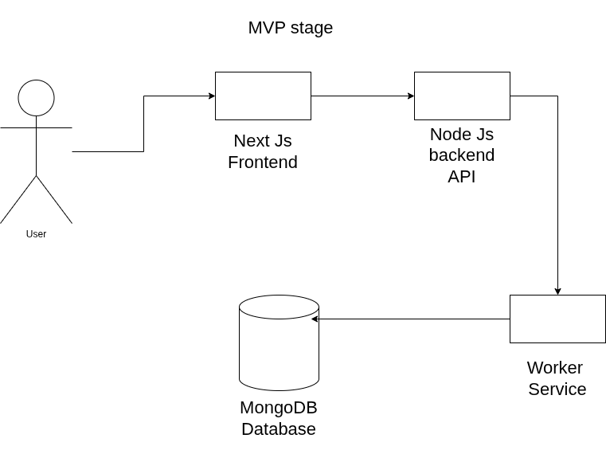
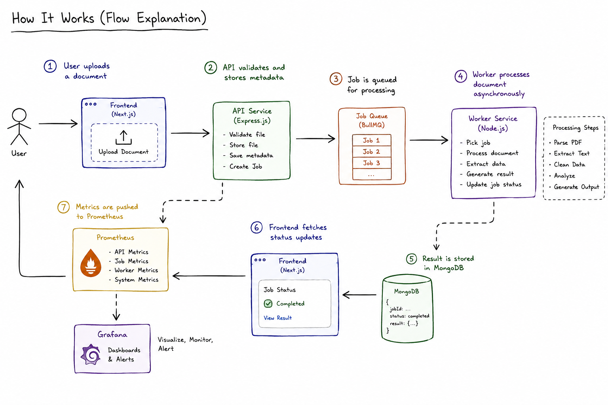

# AI Document Processing Platform (SaaS-style DevOps System)

## Description

> _A distributed platform that automatically processes uploaded documents (PDFs, invoices, CVs) into structured data with real-time tracking, monitoring, and observability._

## Problem Statement

- Companies manually process large volumes of documents
- This is slow, error-prone, and not scalable
- There is no visibility into processing pipelines
- No monitoring of failures or performance

## Solution overview

- Upload documents via web UI
- Backend stores and queues processing jobs
- Worker services process documents asynchronously
- Results stored in MongoDB
- Dashboard shows job status in real-time
- Full observability via Prometheus + Grafana

## Architecture Overview

## Tech Stack

- Frontend: NextJS
- Backend: Node.js (Express)
- Database: MongoDB
- Containerization: Docker
- Orchestration: Kubernetes (Minikube)
- CI/CD: GitHub Actions
- Monitoring: Prometheus + Grafana
- IaC: (Terraform / Kubernetes manifests)

## Features

- File upload system
- Async document processing
- Job queue system
- Real-time job status tracking
- Admin dashboard
- System metrics dashboard
- Containerized microservices
- Kubernetes deployment
- CI/CD pipeline
- Monitoring & alerting

## How it works

## Local setup

1. Clone repo
   `bash git clone https://github.com/Ayoub-45/AI-Document-Processing-Platform.git && cd ./AI-Document-Processing-Platform`
2. Set up docker containers
   `bash docker compose up --build`
3. Run kubernetes manifests
   `bash kubectl apply -f ./k8s`

## CI/CD pipeline

1. GitHub Actions builds Docker images
2. Runs tests
3. Pushes images to registry
4. Deploys to Minikube cluster

## Monitoring

1. Prometheus collects metrics (API latency, job count, failures)
2. Grafana dashboards visualize system health
3. Alerts for failed jobs or high latency
